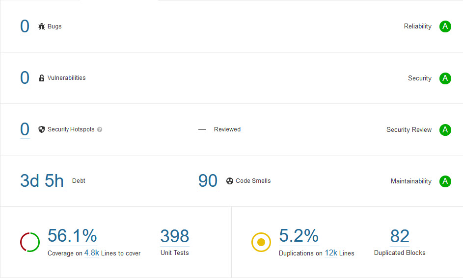

# Verifier of the Swiss Post Voting System

The Swiss Post Voting System requires a verification software—the *verifier*—to verify the cryptographic evidence.
The [specification](https://gitlab.com/swisspost-evoting/e-voting/e-voting-documentation/-/blob/master/System/Verifier_Specification.pdf) and
development of the verifier goes hand in hand with the Swiss Post Voting System, and the verifier challenges and extensively tests a protocol run.
🛑 **IMPORTANT: The current source code of this repository is not aligned with the last version of the specification (v1.0). The new version of the
verifier source code will be available in August 2022**. The Swiss Post Voting System consists of three phases, and each one has at least one
verification algorithm.

| Block                          | Phase         | Algorithm          |
|--------------------------------|---------------|--------------------|
| Pre-election verification      | Configuration | VerifyConfigPhase  |
| Ballot box verification        | Voting        | VerifyVotingPhase  |
| Mixing decryption verification | Tally         | VerifyOnlineTally  |
| Result verification            | Tally         | VerifyOfflineTally |

Similar to the [e-voting solution](https://gitlab.com/swisspost-evoting/e-voting/e-voting) and
the [crypto-primitives library](https://gitlab.com/swisspost-evoting/crypto-primitives/crypto-primitives), the verifier source code follows a
[precise and unambiguous pseudo-code verifier specification](https://gitlab.com/swisspost-evoting/e-voting/e-voting-documentation/-/blob/master/System/Verifier_Specification.pdf)
to bridge the representational gap between mathematics and code.

The verifier's execution must fulfill the following conditions:

* The verifier is operated by the electoral commission under the responsibility of the cantons, **not** by Swiss Post.
* The verifier instance is **offline**. The verifier receives data only via secure USB transfer.
* The machine running the verifier is hardened and has no other purpose than running the
  verifier software.

In general, the verifier heeds web application security best practices when appropriate.
However, we do not enforce authentication between the application's frontend and backend parts, and we omit HTTP security headers.
Please note that while the verifier uses web technologies for the user interface, the verifier backend accepts only local traffic.
If the adversary controls the verifier instance, he could access the internal file system, and sniffing the local HTTP traffic would be pointless.
To prevent an attacker from controlling a verifier instance, we implement the operational safeguards described above.

## Under which license is this code available?

The verifier is released under Apache 2.0.

## Code Quality

We strive for excellent code quality to minimize the risk of bugs and vulnerabilities. We rely on the following tools for code analysis.

| Tool        | Focus                 |
|-------------|-----------------------|
| [SonarQube](https://www.sonarqube.org/)  | Code quality and code security      |
| [JFrog X-Ray](https://jfrog.com/xray/) | Common vulnerabilities and exposures (CVE) analysis, Open-source software (OSS) license compliance | |

### SonarQube Analysis

We parametrize SonarQube with the built-in Sonar way quality profile. The SonarQube analysis of the verifier code reveals 0 bugs, 0 vulnerabilities, 0
security hotspots, and 263 code smells.

The verifier contains 90 code smells in the code. [Code smells](https://docs.sonarqube.org/latest/user-guide/concepts/) are
maintainability-related issues that might increase the likelihood of errors in future code changes but do not directly impact the code's security and
robustness. An example would be a method that contains too many if/else statements, therefore has a high cognitive complexity, hence is difficult to
maintain. We plan to fix code smells continuously in future versions of the verifier.

Moreover, the verifier's code base incurs some code duplication since every verification class uses a specific template defining the verification IDs
and category.

### JFrog X-Ray Analysis

At the time of writing (November 2021), the published source code does not contain any declared dependencies with known vulnerabilities.

## Known Issues

The current version of the verifier source code has the following known issues:

* Elections with lists are not supported.
* Block 1 and 4 only partially implement the consistency checks.
* Block 1 and 4 only partially implement the authenticity checks.

## Future Work

We plan for the following improvements to the verifier:

* Block 4: specify the verification of eCH-files in pseudo-code.
* Reduce the number of code smells in the source code.
* Reduce code duplication in the source code.

## Build information

The following instructions provide step-by-step information to build the Verifier of the Swiss Post Voting System on a Windows machine.

1. Ensure you have Maven and Node installed. We tested with following versions:
    * OpenJDK Runtime Environment Temurin-17.0.3+7 (build 17.0.3+7)
    * Apache Maven 3.8.6 (3599d3414f046de2324203b78ddcf9b5e4388aa0)
    * Node: v14.17.0
2. Set the following environment properties:
   * DIRECT_TRUST_KEYSTORE_LOCATION
   * DIRECT_TRUST_KEYSTORE_PASSWORD_LOCATION

3. Build using Maven
    * `mvn clean install`

4. The generated artifact is generated in verifier-assembly\target\verifier-assembly-\<VERSION>.zip

## Run

1. Unzip the generated artifact and then launch Verifier.exe.

2. Copy the path of the dataset into the input directory field - you can find a test dataset in the ./dataset subfolder.

3. Click "Start-all" to run all verifications.

