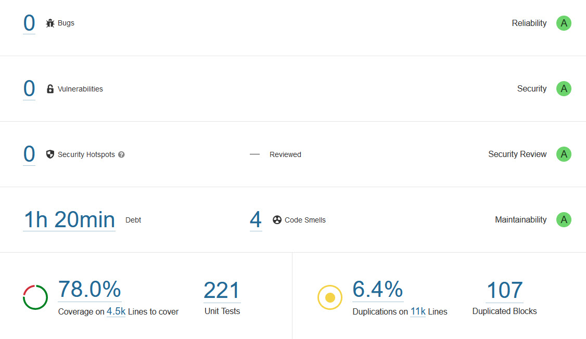

# Verifier of the Swiss Post Voting System

The Swiss Post Voting System requires a verification software—the *verifier*—to verify the cryptographic evidence.
The [specification](https://gitlab.com/swisspost-evoting/e-voting/e-voting-documentation/-/blob/master/System/Verifier_Specification.pdf) and
development of the verifier goes hand in hand with the Swiss Post Voting System, and the verifier challenges and extensively tests a protocol run.

Similar to the [e-voting solution](https://gitlab.com/swisspost-evoting/e-voting/e-voting) and
the [crypto-primitives library](https://gitlab.com/swisspost-evoting/crypto-primitives/crypto-primitives), the verifier source code follows a
[precise and unambiguous pseudo-code verifier specification](https://gitlab.com/swisspost-evoting/e-voting/e-voting-documentation/-/blob/master/System/Verifier_Specification.pdf)
to bridge the representational gap between mathematics and code.

The verifier's execution must fulfill the following conditions:

* The verifier is operated by the electoral commission under the responsibility of the cantons, **not** by Swiss Post.
* The verifier instance is **offline**. The verifier receives data only via secure USB transfer.
* The machine running the verifier is hardened and has no other purpose than running the
  verifier software.

In general, the verifier heeds web application security best practices when appropriate.
However, we do not enforce authentication between the application's frontend and backend parts, and we omit HTTP security headers.
Please note that while the verifier uses web technologies for the user interface, the verifier backend accepts only local traffic.
If the adversary controls the verifier instance, he could access the internal file system, and sniffing the local HTTP traffic would be pointless.
To prevent an attacker from controlling a verifier instance, we implement the operational safeguards described above.

## Under which license is this code available?

The verifier is released under Apache 2.0.

## Code Quality

We strive for excellent code quality to minimize the risk of bugs and vulnerabilities. We rely on the following tools for code analysis.

| Tool                                    | Focus                                                                                              |
|-----------------------------------------|----------------------------------------------------------------------------------------------------|
| [SonarQube](https://www.sonarqube.org/) | Code quality and code security                                                                     |
| [JFrog X-Ray](https://jfrog.com/xray/)  | Common vulnerabilities and exposures (CVE) analysis, Open-source software (OSS) license compliance | |

### SonarQube Analysis

We parametrize SonarQube with the built-in Sonar way quality profile. The SonarQube analysis of the verifier code reveals 0 bugs, 0 vulnerabilities, 0
security hotspots, and 4 code smells.

The verifier contains 4 code smells in the code. [Code smells](https://docs.sonarqube.org/latest/user-guide/concepts/) are
maintainability-related issues that might increase the likelihood of errors in future code changes but do not directly impact the code's security and
robustness. An example would be a method that contains too many if/else statements, therefore has a high cognitive complexity, hence is difficult to
maintain.

### JFrog X-Ray Analysis

The X-Ray analysis indicates that the published source code contains no directly dependent Java component with known vulnerabilities except
for the vulnerability [CVE-2016-1000027](https://nvd.nist.gov/vuln/detail/CVE-2016-1000027) in the Spring framework.
This particular vulnerability is [somewhat contested](https://github.com/spring-projects/spring-framework/issues/24434)
and our internal analysis concluded that it cannot be exploited in the verifier of the Swiss Post Voting System.

## Changelog

An overview of all major changes within the published releases is available [here](CHANGELOG.md).

## E-voting Compatibility

The following table indicates the correspondence between the Verifier and E-voting system version.

| Verifier version | [E-voting](https://gitlab.com/swisspost-evoting/e-voting/e-voting) version |
|------------------|----------------------------------------------------------------------------|
| 1.2.0            | 1.1.0                                                                      |
| 1.3.0            | 1.2.0                                                                      |
| 1.3.1            | 1.2.1                                                                      |
| 1.3.2            | 1.2.2                                                                      |
| 1.3.3            | 1.2.3                                                                      |
| 1.4.0            | 1.3.0                                                                      |
| 1.4.1            | 1.3.1                                                                      |
| 1.4.2            | 1.3.2                                                                      |
| 1.4.3            | 1.3.3                                                                      |

## Build information

The following instructions provide step-by-step information to build the Verifier of the Swiss Post Voting System on a Windows machine.

1. Ensure you have Maven and Node installed. We tested with following versions:
   * OpenJDK Runtime Environment Temurin-21.0.1+12 (build 21.0.1+12)
    * Apache Maven 3.9.4
    * Node: v18.19.0

2. Build using Maven
    * `mvn clean install`

3. The generated artifact is located in verifier-assembly\target\verifier-assembly-\<VERSION>.zip.

## Run

1. Unzip the generated artifact.

2. Ensure that the verifier's keystore and the keystore's password file are located at the place indicated in the
   file [application.properties](./verifier-assembly/src/main/resources/application.properties).

3. Launch the Verifier.exe.

4. Click on the dataset upload section and select a dataset. You can find a test dataset in the [./datasets](./datasets) subfolder.

5. Click on 'Verify Setup' to run the setup verifications, or click on 'Verify Tally' to run the tally verifications.
